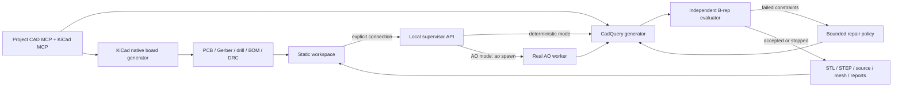

# Architecture and boundaries

The last MCP-to-KiCad arrow represents tool access to the board, not a claim that MCP generated the native board script. KiCad files are built through `pcbnew`; the installed MCP independently inspected the result. CAD MCP tools actually build/evaluate and can generate/revise the fixed model.

The supervisor validates numeric bounds, creates an opaque job ID, and serializes expensive jobs. AO mode launches a genuine worker with a fixed trusted command and UUID. The user brief stays in JSON; it is never interpolated into an agent prompt or shell command. The worker executes the real CAD pipeline. It does not invent code from arbitrary prompts; its correction policy is explicit and deterministic. This proves the orchestration path while keeping a feasible and honest scope.

Each iteration builds new solids, measures them, exports them and records its specification. A failed result is retained. The repair policy reacts only to failed thickness, tray-wall and clearance checks, raises them to the required values, and re-runs the evaluator. It stops on acceptance, no available correction, or three iterations. Unsupported failures remain failures.

The B-rep evaluator is separate from the generator and repair policy. Tests deliberately replace the actual base solid while leaving the specification unchanged to prove measurements are not merely echoes of input parameters. STEP export is re-imported and checked for validity.

The board is a fixed mechanical/electrical exemplar. The web model shows a 60×40×1.6 mm board envelope; it does not claim pad-accurate board 3D or full ECAD/MCAD synchronization. Browser board layout is an actual KiCad SVG; connectivity is derived from the four saved nets. No native schematic or ERC was generated. Board DRC uses KiCad defaults and explicitly retains ignored checks.

Live CAD jobs change chassis dimensions and keep this fixed board. A next engineering stage would design board retention/fasteners, axle/motor mounts, electrical motor control, electrical protection, netlist/schematic parity, assembly collision and stress checks, and physical prototypes. Those capabilities are not silently assumed here.

Security boundaries: no arbitrary executable CAD input, project-scoped MCP write directories, bounded spec values, serialized CAD jobs, same-origin default, explicit origin/token opt-in, and separate public static hosting. Native CAD dependencies and AO still run with the operator's OS privileges: use a sandboxed private service for untrusted multi-user hosting. The example server is an operator-owned local runner, not a hardened public job platform. A restart loses active in-process supervision; retained files remain inspectable. It does not automatically resume jobs.
